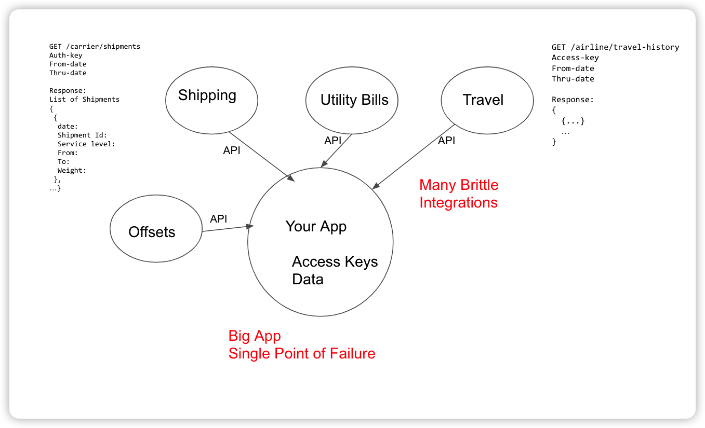
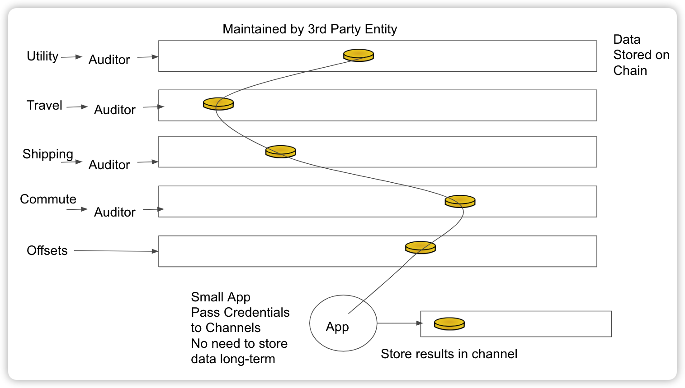

# Carbon Accounting

> Use Cases
Decarbonization of supply chain, or Scope 3, emissions remains a hard problem for many reasons, even as regulatory compliance, such as the EU carbon border tax, the EU Carbon Boarder Adjustment Mechanism targeting imports of energy intense commodities, make it increasingly important.  Our solution offers the following advantages:

Cost of carbon foot-printing - We're free. (微笑)
Creating incentives for suppliers - Customers, either big ones or a group of small ones, could set up their own "cap and trade" scheme: Declare their supply chain emissions targets which decline over time, aligning with the Paris Agreement (-50% by 2030, zero by 2050.)  Allocate tokens to suppliers based on those targets.  Suppliers can trade their emissions with each other but over time must reduce them as a whole.
Providing turnkey solutions - Again using tokens, major customers could either invest in emissions projects directly and provide them to their customers (like Apple and "Enabling carbon neutrality across the value chain" in this article) or provide financing or guarantees for financing for suppliers.

Verification - Could be done through this ledger.
Going deep - Suppliers could get their suppliers on the ledger, and tokens could be transferred further up the supply chain.
Address the pain points, needs and interests of emerging regulations like the CBAM on the international stage
Communicate the importance of corporate carbon reduction efforts

## Reference

- [Supply Chain Decarbonization](https://wiki.hyperledger.org/display/CASIG/Supply+Chain+Decarbonization)