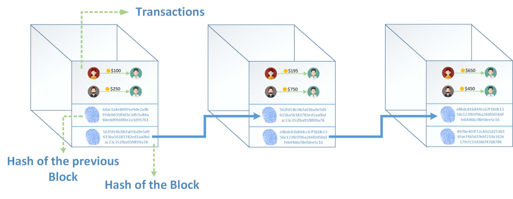
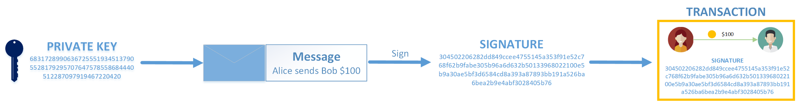

---
# try also 'default' to start simple
# theme: seriph
# random image from a curated Unsplash collection by Anthony
# like them? see https://unsplash.com/collections/94734566/slidev
# background: https://source.unsplash.com/collection/94734566/1920x1080
# apply any windi css classes to the current slide
class: 'text-center'
# https://sli.dev/custom/highlighters.html
highlighter: shiki
# show line numbers in code blocks
lineNumbers: true
# some information about the slides, markdown enabled
info: |
  ## Blockchain Intro 
  Presentation slides for blockchain introduction.

# persist drawings in exports and build
drawings:
  persist: false
---

# 区块链介绍

区块链(blockchain)技术和应用简介

  
    区块链-101 <carbon:arrow-right class="inline"/>
  

  <button @click="$slidev.nav.openInEditor()" title="Open in Editor" class="text-xl icon-btn opacity-50 !border-none !hover:text-white">
    <carbon:edit />
  </button>
  <a href="https://github.com/slidevjs/slidev" target="_blank" alt="GitHub"
    class="text-xl icon-btn opacity-50 !border-none !hover:text-white">
    <carbon-logo-github />
  </a>

<!--
The last comment block of each slide will be treated as slide notes. It will be visible and editable in Presenter Mode along with the slide. [Read more in the docs](https://sli.dev/guide/syntax.html#notes)
-->

---

# 什么是区块链？

- 区块链就是用链表的方式来存储数据:

- 区块链详细点的解释:
> A blockchain is a growing list of records, called ***blocks***, that are linked using ***cryptography***. Each block contains a ***cryptographic hash*** of the previous block, a ***timestamp***, and transaction data (generally represented as a ***Merkle tree***)

- 两个最主要的两个关键特性：
  - 分布式总帐(distributed ledger): 账本存储在不同的网络节点上
  - 不可变(Immutable): 一旦交易(transaction)构建在区块链上，账本就不能被更改

 

<!--
You can have `style` tag in markdown to override the style for the current page.
Learn more: https://sli.dev/guide/syntax#embedded-styles
-->

---

# Blockchain - 块(Block)
***一个块里面包含的内容***:
- Transaction数据，一个块可以包含很多transaction
- 当前块的block hash
- 之前块的block hash

--- 

## Blockchain - 块(Block)/交易(transaction)

- 交易: Alice 发送¥100 给Bob
- 块包含很多交易，很多类似的交易打包在一个块中,每一个块都有一个blockhash

--- 

## Blockchain - Current Block hash/ Previous Block hash

- 如果一个块的数据被改动，那么blockhash也会完全变
- 那么只要一个块的hash被改动，那么整个块的单链表结构接被改变
- immutable不可变

---

## Blockchain - 分布式账本

- 账本不是存在一台机器上,一个Blockchain实例是一个节点(node)
- 账本存储在peer-to-peer(p2p)网络中的不同节点上
- 每一个节点都有一份账本,有全节点/轻节点之分

---

## Blockchain - 账本共识(consensus)

区块链新增块需要网络中节点达成共识(consensus):

- 产生新的块,网络中的节点都需要检查和Check所有的块中的交易
- 同意所有的交易，就可以在区块链中增加新的块

---

## Blockchain - 如何在Blockchain中创建一个交易

1. public key(用户地址/名称)/private key(用来发送交易时候做签名)
2. public key/private key完全是客户端行为和blockchain关系不大(去中心化的)
3. 发送交易后的上链通过共识机制确认,依赖共识算法而不依赖中间人
---

## 什么是Blockchain的小结

- transaction/block/blockhash
- node/p2p网络/共识(consensus)
- public-key/private-key

- [blockchain-simple-explanation](https://hackernoon.com/blockchain-a-short-and-simple-explanation-with-pictures-d60d652f207f)
  
## Blockchain的类型

不同种类的区块链：
1. public blockchain: 公链
2. private blockchain: 私有链
3. Permissioned blockchain: 联盟链

## Blockchain的应用- Layer1 Chain

- Bitcoin - 比特币网络
- Ethereum - 以太坊网络

## Bitcoin

---

## Ethereum

# Learn More

[Documentations](https://sli.dev) · [GitHub](https://github.com/slidevjs/slidev) · [Showcases](https://sli.dev/showcases.html)
